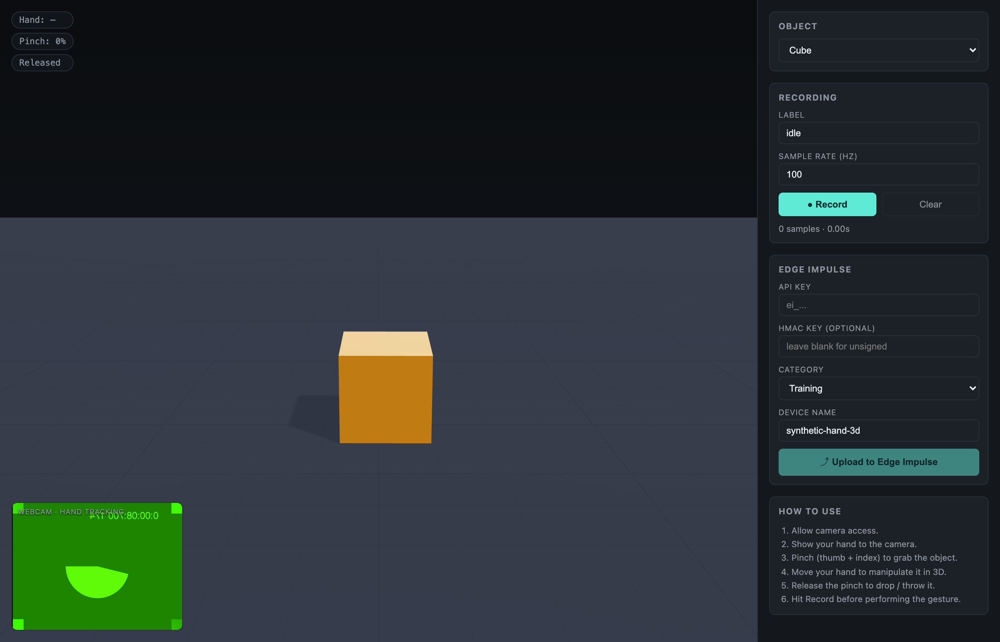

# Synthetic Accelerometer Data Studio

A browser-based 3D tool for generating synthetic IMU / accelerometer training data by manipulating a virtual object with your hand via webcam, then uploading the captured signal directly to an [Edge Impulse](https://www.edgeimpulse.com/) project.

Pinch a virtual cube (or sphere / phone / capsule) in 3D space using your bare hand, throw it onto the ground, and the physics engine generates realistic 3-axis accelerometer data — the same kind of signal a real IMU strapped to that object would produce. Record, label, and ship to Edge Impulse with one click.

Created with Claude Code.



## Features

- **Hand tracking** via Google MediaPipe `HandLandmarker` (runs in-browser on GPU/WASM, ~60 fps).
- **Pinch-to-grab** gesture: thumb + index fingertip distance, hysteresis-filtered to avoid flicker.
- **Throw / drop physics**: when you release the pinch, the object inherits your hand's velocity and falls under gravity, collides with the ground, bounces.
- **Proper-acceleration math**: emits the signal a real accelerometer would — `+9.81 m/s²` along the up axis when stationary, near-zero in freefall — transformed into the object's local body frame.
- **Configurable sample rate** (20–500 Hz, default 100 Hz).
- **Multiple object types**: cube, sphere, phone-slab, capsule. Trivially extensible.
- **Live HUD**: hand-tracked indicator, pinch %, grab state, recording sample count.
- **Direct Edge Impulse upload** via the [Ingestion API](https://docs.edgeimpulse.com/reference/data-ingestion/ingestion-api), with optional HMAC-SHA256 signing.
- **API key never persisted** — held in memory for the session only. Refresh the page = key gone.

## Tech stack

| Layer | Library |
|---|---|
| Build | Vite + React 18 + TypeScript |
| 3D rendering | three.js + `@react-three/fiber` + `@react-three/drei` |
| Physics | Rapier (`@react-three/rapier`) |
| Hand tracking | `@mediapipe/tasks-vision` (HandLandmarker, GPU delegate) |
| State | Zustand |
| Upload | Fetch + WebCrypto SubtleCrypto (for HMAC) |

## Quick start

```bash
npm install
npm run dev
```

Open **http://localhost:5173** in a Chromium-based browser (Chrome, Edge, Brave) — Safari's MediaPipe support is more limited.

> **Camera permission is required.** The first time the page loads, allow camera access when prompted. The browser must serve over `localhost` or HTTPS for `getUserMedia` to work.

## How to record a sample

1. **Show your hand** to the camera. The pill in the top-left will read `Hand: tracked` and the pinch % updates live.
2. **Pinch** (thumb + index together) to grab the object — it turns teal and follows your hand in 3D.
3. **Move / shake / orient** your hand to perform the motion you want to capture.
4. **Release the pinch** to drop. A fast downward pinch-then-release will throw the object onto the ground.
5. Click **● Record** *before* the gesture (or while grabbing) to start sampling. Click **■ Stop** when done.
6. Paste your Edge Impulse API key, set a label (e.g. `shake`, `drop`, `idle`, `tilt`), and click **⤴ Upload to Edge Impulse**.

Sample buffer clears automatically after a successful upload.

## Edge Impulse setup

1. In your Edge Impulse project: **Dashboard → Keys** → copy the **API key** (starts with `ei_`).
2. (Optional but recommended) Copy the **HMAC key** from the same page if you want signed uploads. Without it, the app sends `alg: "none"` payloads, which most projects accept by default.
3. Paste both into the sidebar. Choose **Training** or **Testing** as the destination dataset.
4. After upload, the sample appears under **Data acquisition** in your project, labeled with whatever you typed in **Label**.

The payload conforms to the [Edge Impulse data acquisition format](https://docs.edgeimpulse.com/reference/data-acquisition-format):

```json
{
  "protected": { "ver": "v1", "alg": "none|HS256", "iat": 1717000000 },
  "signature": "<64-char hex or zeros>",
  "payload": {
    "device_name": "synthetic-hand-3d",
    "device_type": "WEB_SIMULATOR",
    "interval_ms": 10,
    "sensors": [
      { "name": "accX", "units": "m/s2" },
      { "name": "accY", "units": "m/s2" },
      { "name": "accZ", "units": "m/s2" }
    ],
    "values": [[ax, ay, az], ...]
  }
}
```

## Project structure

```
src/
├── App.tsx                  // Layout: scene + sidebar
├── main.tsx                 // React entry
├── styles.css               // Dark theme, sidebar / HUD / webcam overlay styles
├── components/
│   ├── Scene.tsx            // r3f canvas, physics, sampling loop, mesh swap
│   ├── CameraFeed.tsx       // Webcam + MediaPipe + skeleton overlay
│   ├── Hud.tsx              // Top-left status pills
│   └── Sidebar.tsx          // All controls (object, recording, EI config)
├── lib/
│   ├── handTracking.ts      // HandLandmarker init, pinch + centroid math
│   └── edgeImpulse.ts       // Ingestion API client (HMAC optional)
└── store/
    └── useStore.ts          // Zustand store (samples, config, status)
```

## How the accelerometer signal is computed

A real IMU measures **proper acceleration** — what you feel relative to free-fall, *not* coordinate acceleration. The two are related by:

```
a_proper = a_inertial − g_world
```

where `g_world = (0, −9.81, 0)`.

For each sampling tick (at the configured `sampleRateHz`):

1. Read the rigid body's linear velocity from Rapier.
2. Numerically differentiate against the previous tick's velocity → `a_inertial` in world space.
3. Subtract the gravity vector → `a_proper` (still in world space).
4. Rotate into the object's local frame using the inverse of its current orientation quaternion.
5. Push `(t, ax, ay, az)` into the recording buffer.

This means a stationary object reads `(0, +9.81, 0)` (the ground pushes up against gravity), a freefalling object reads `(0, 0, 0)`, and during a hand-driven shake you get the kind of waveform you'd expect from a real accelerometer.

## Adding new object types

Edit `src/store/useStore.ts`:

```ts
export type ObjectKind = 'cube' | 'sphere' | 'phone' | 'capsule' | 'newKind';
```

Add a case in `ObjectMesh` inside `src/components/Scene.tsx`, and an entry in the `OBJECTS` array in `src/components/Sidebar.tsx`. The physics body, sampling, and gesture wiring are already kind-agnostic.

## Tuning

| What | Where | Default |
|---|---|---|
| Pinch-on / pinch-off thresholds | `CameraFeed.tsx` | 0.65 / 0.45 |
| Kinematic follow smoothing | `Scene.tsx` `FOLLOW_LERP` | 0.35 |
| Restitution (bounciness) | `Scene.tsx` `RigidBody` | 0.45 |
| Friction | `Scene.tsx` `Ground` | 0.8 |
| Sample rate | UI / `useStore.ts` | 100 Hz |
| Scene-space mapping (image → 3D) | `CameraFeed.tsx`, end of `tick()` | x:±3, y:−1.5..3.5, z·8 |

## Privacy notes

- The webcam stream **never leaves the browser**. MediaPipe runs locally; only the recorded accelerometer samples (numbers) are uploaded.
- API keys are kept in JavaScript memory only — not in `localStorage`, `sessionStorage`, cookies, or any file. Reload = wiped.
- Edge Impulse uploads use HTTPS to `ingestion.edgeimpulse.com`.

## Troubleshooting

**Camera permission denied** — Allow camera in your browser's site settings, then reload. Must be served over `localhost` or HTTPS.

**`Hand: —` even with hand visible** — Check lighting; MediaPipe needs a reasonably lit, unobstructed view of the hand. Try rolling your sleeve up.

**Object jitters or escapes the scene** — Lower `FOLLOW_LERP` in `Scene.tsx` for smoother but laggier follow.

**Edge Impulse 401 / 403** — API key missing or invalid. Double-check **Dashboard → Keys** in your project.

**Edge Impulse "invalid signature"** — Either fill in the HMAC key from your project, or leave it blank to send unsigned (`alg: "none"`).

## Build for production

```bash
npm run build
npm run preview
```

The output in `dist/` is a static bundle — host on any static host (Netlify, Vercel, GitHub Pages, S3, etc.). No server needed; all hand tracking runs client-side.

## License

MIT (or whatever you want — this is your project).
