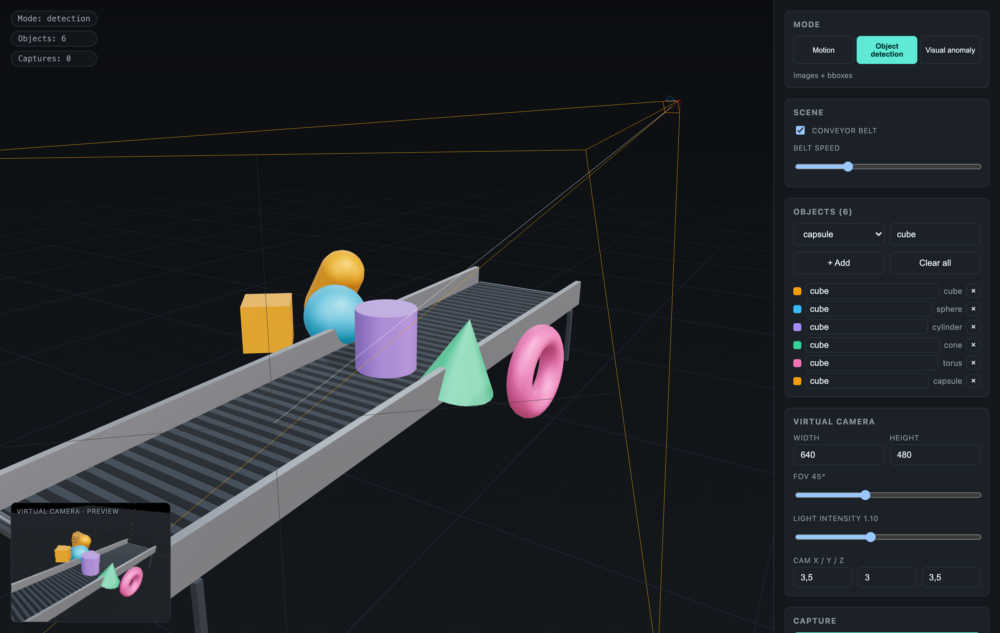
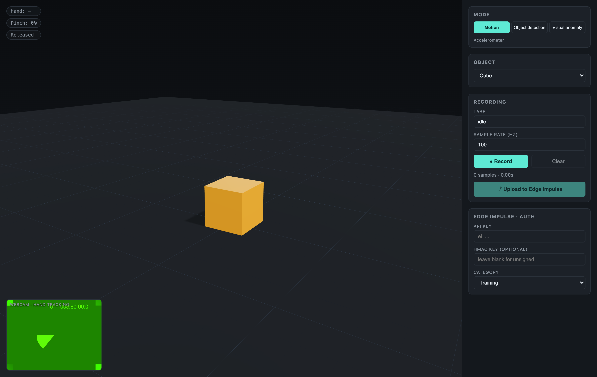

# Synthetic Data Studio

A browser-based 3D tool for generating synthetic training data for [Edge Impulse](https://www.edgeimpulse.com/) projects. Three modes in one app:

- **Motion** — Manipulate a virtual object with hand-tracked pinch gestures via your webcam, capture realistic 3-axis accelerometer data, and upload to Edge Impulse.
- **Object detection** — Drop objects (cube, sphere, cylinder, cone, torus, capsule, phone slab) into the scene, optionally onto a conveyor belt, point a virtual camera at them, capture single shots or randomized batches with bounding boxes auto-projected, save to a local directory, and upload as a labelled image dataset.
- **Visual anomaly detection** — Same capture pipeline as detection, but emits unlabelled images with a single batch-level label (e.g. `normal` / `anomaly`).

Created with Claude Code.



*Object detection mode: 6 labelled objects on a scrolling conveyor belt, virtual capture camera shown as the orange frustum gizmo, live preview in the bottom-left corner.*



*Motion mode: pinch the cube with your hand to grab it, throw it onto the ground, record the accelerometer trace.*

## Features

### Shared
- **Realistic 3D scene** — HDRI environment lighting (`warehouse` preset), ACES Filmic tone mapping, soft shadows, contact shadows, infinite ground grid.
- **Live HUD** with mode-aware status pills.
- **Direct Edge Impulse upload** via the [Ingestion API](https://docs.edgeimpulse.com/reference/data-ingestion/ingestion-api).
- **API key never persisted** — held in memory for the session only.

### Motion mode
- **Hand tracking** via Google MediaPipe `HandLandmarker` (in-browser, GPU/WASM, ~60 fps).
- **Pinch-to-grab** with thumb–index distance, hysteresis-filtered.
- **Throw / drop physics** — released objects inherit your hand's velocity.
- **Proper-acceleration math** — emits the signal a real IMU would (`+9.81 m/s²` up when stationary, near-zero in freefall), transformed into the object's local body frame.
- **Configurable sample rate** (20–500 Hz, default 100 Hz).
- HMAC-SHA256 signed uploads optional.

### Object detection / Visual anomaly mode
- **Multi-object spawning** — add any number of objects to the scene with custom labels and colors. Objects fall under physics onto the ground or conveyor.
- **Conveyor belt prop** — animated scrolling belt with rails, end rollers, and supports. Speed-tunable. Acts as a static collider.
- **Virtual capture camera** — fully positionable (XYZ + target + FOV), with a frustum gizmo drawn into the scene so you can orbit around and see exactly what it sees.
- **Live capture preview** in the corner overlay.
- **Single-shot capture** — one button, one image saved.
- **Randomized batch capture** — capture *N* images while jittering camera position, light direction & intensity, and/or object positions/rotations between shots. Toggleable per axis.
- **Auto-projected bounding boxes** — for each labelled mesh in view, the 8 world-space AABB corners are projected to screen-space, clipped, and emitted as `{label, x, y, width, height}` in pixels.
- **File System Access API** — pick a directory once, all captures save directly into it. Falls back to per-file downloads in browsers without the API.
- **Edge Impulse `bounding_boxes.labels` sidecar** — write the file Edge Impulse expects when uploading pre-labelled detection data via the Studio.
- **Direct image upload** — multipart upload to `/api/{training,testing}/files` with bounding boxes attached via the `x-bounding-boxes` header.

## Tech stack

| Layer | Library |
|---|---|
| Build | Vite + React 18 + TypeScript |
| 3D rendering | three.js + `@react-three/fiber` + `@react-three/drei` |
| Physics | Rapier (`@react-three/rapier`) |
| Hand tracking | `@mediapipe/tasks-vision` (HandLandmarker, GPU delegate) |
| State | Zustand |
| Disk saves | File System Access API (`showDirectoryPicker`) |
| Upload | Fetch + WebCrypto SubtleCrypto (for HMAC) |

## Quick start

```bash
npm install
npm run dev
```

Open **http://localhost:5173** in a Chromium-based browser (Chrome, Edge, Brave). The File System Access API and MediaPipe both work best on Chromium; Safari/Firefox users will get per-file downloads instead of directory saves.

> **Camera permission is required for Motion mode.** Detection / Anomaly modes don't use the webcam and run anywhere.

## Workflows

### Recording motion data

1. Switch to **Motion** mode (default).
2. Show your hand to the camera. The pill in the top-left will read `Hand: tracked`.
3. **Pinch** (thumb + index together) to grab the object — it turns teal and follows your hand.
4. Move / shake / orient your hand. Release the pinch to drop or throw.
5. Click **● Record** before the gesture, **■ Stop** when done.
6. Paste your Edge Impulse API key, set a label, click **⤴ Upload**.

### Capturing object-detection data

1. Switch to **Object detection** mode.
2. (Optional) Toggle **Conveyor belt** in the Scene card.
3. Add objects from the **Objects** card — pick a kind, type a label, hit **+ Add**. Repeat for as many objects/classes as you need. Edit the label of any object inline; remove with `×`.
4. Position the **Virtual camera** in the Virtual Camera card. The orange frustum gizmo updates live in the scene; the corner preview shows the captured framing.
5. Click **Choose directory…** and pick where the PNGs go (Chromium only). On Safari/Firefox they'll just download.
6. Click **📸 Capture frame** for one image, or set a batch count + randomization toggles and click **⚡ Capture batch (N)**.
7. (Optional) Click **💾 Write bounding_boxes.labels** to save the Edge Impulse sidecar JSON alongside your images — you can then drag the whole folder into the Edge Impulse Studio uploader.
8. Or upload directly: paste your API key and click **⤴ Upload N images**. Each image is sent with its bounding boxes.

### Capturing visual-anomaly data

1. Switch to **Visual anomaly** mode.
2. Set up scene + camera the same way.
3. Type a batch label (e.g. `normal` or `anomaly`).
4. Capture frames or batches — each image gets the batch label. Bounding boxes are not attached.
5. Save to disk and/or upload to Edge Impulse.

## Edge Impulse setup

1. **Dashboard → Keys** in your Edge Impulse project.
2. Copy the **API key** (`ei_…`). For motion mode, optionally also copy the **HMAC key** for signed uploads.
3. Paste into the sidebar; choose **Training** or **Testing**.

### Payload formats

**Motion mode** (`/api/{training,testing}/data`):

```json
{
  "protected": { "ver": "v1", "alg": "none|HS256", "iat": 1717000000 },
  "signature": "<64-char hex>",
  "payload": {
    "device_name": "synthetic-hand-3d",
    "device_type": "WEB_SIMULATOR",
    "interval_ms": 10,
    "sensors": [
      { "name": "accX", "units": "m/s2" },
      { "name": "accY", "units": "m/s2" },
      { "name": "accZ", "units": "m/s2" }
    ],
    "values": [[ax, ay, az], ...]
  }
}
```

**Detection / Anomaly mode** (`/api/{training,testing}/files`, multipart):

- Form field `data` = the PNG blob
- Header `x-label` = label
- Header `x-bounding-boxes` (detection only) = `[{"label":"cube","x":120,"y":80,"width":56,"height":56}, ...]`

The `bounding_boxes.labels` sidecar (written via the **💾** button) follows the [Edge Impulse uploader format](https://docs.edgeimpulse.com/docs/edge-impulse-studio/data-acquisition/uploader#bounding-boxes):

```json
{
  "version": 1,
  "type": "bounding-box-labels",
  "boundingBoxes": {
    "frame.2026-05-06T11-00-00.0000.png": [
      { "label": "cube", "x": 120, "y": 80, "width": 56, "height": 56 }
    ]
  }
}
```

## Project structure

```
src/
├── App.tsx                       // Mode-aware layout
├── main.tsx                      // React entry
├── styles.css                    // Dark theme
├── components/
│   ├── Scene.tsx                 // r3f canvas, lighting, mode-aware scene tree
│   ├── CameraFeed.tsx            // Webcam + MediaPipe (motion mode)
│   ├── Hud.tsx                   // Top-left status pills
│   ├── Sidebar.tsx               // Mode switcher + panel router
│   ├── MotionPanel.tsx           // Motion-mode controls
│   ├── VisionPanel.tsx           // Detection / Anomaly controls
│   ├── Conveyor.tsx              // Animated conveyor belt prop
│   ├── SpawnedObjects.tsx        // Multi-object spawn renderer
│   └── VirtualCamera.tsx         // Capture camera, frustum gizmo, batch logic
├── lib/
│   ├── handTracking.ts           // HandLandmarker + pinch math
│   ├── capture.ts                // Off-screen render, bbox projection, FS Access
│   └── edgeImpulse.ts            // Ingestion API: motion + image+bbox uploads
└── store/
    └── useStore.ts               // Zustand store (single source of truth)
```

## How the accelerometer signal is computed

A real IMU measures **proper acceleration** — what you feel relative to free-fall, *not* coordinate acceleration:

```
a_proper = a_inertial − g_world
```

where `g_world = (0, −9.81, 0)`.

Per sampling tick: read Rapier `linvel` → numerically differentiate → subtract gravity → rotate into the body's local frame using the inverse orientation quaternion → push to buffer.

So: stationary object reads `(0, +9.81, 0)` (ground pushes up against gravity), freefall reads `(0, 0, 0)`, hand-driven shake gives a realistic IMU waveform.

## How bounding boxes are computed

For each mesh tagged with `userData.label`:

1. Compute (or read cached) **local-space AABB** from `geometry.boundingBox`.
2. Transform all 8 corners by `mesh.matrixWorld` → world space.
3. Project each corner with the capture camera (`vector.project(camera)`) → NDC.
4. Discard corners behind the near plane.
5. Convert NDC → pixel coordinates with the capture resolution; track min/max x and y.
6. Clip to the image rectangle, drop boxes < 4×4 px (degenerate / fully occluded).

Result: tight axis-aligned 2D boxes in pixel coordinates with top-left origin — exactly what Edge Impulse expects.

## Tuning

| What | Where | Default |
|---|---|---|
| Pinch-on / pinch-off thresholds | `CameraFeed.tsx` | 0.65 / 0.45 |
| Kinematic follow smoothing | `Scene.tsx` `FOLLOW_LERP` | 0.35 |
| Restitution (bounciness) | `Scene.tsx` `RigidBody` | 0.45 |
| Friction | `Scene.tsx` `Ground` | 0.8 |
| Sample rate | UI / `useStore.ts` | 100 Hz |
| Capture resolution | UI | 640 × 480 |
| Camera-jitter radius (batch) | `VirtualCamera.tsx` `r` | 0.6 m |
| Light-intensity jitter range | `VirtualCamera.tsx` | ±0.8 |
| Conveyor belt size | `Conveyor.tsx` | 1.6 × 8 m |

## Privacy notes

- The webcam stream **never leaves the browser** in any mode. MediaPipe runs locally; only data you explicitly capture/upload is sent anywhere.
- API keys are kept in JavaScript memory only — not in `localStorage`, `sessionStorage`, cookies, or any file. Reload = wiped.
- Image saves go to your local disk (or downloads); only Edge Impulse uploads leave the machine, over HTTPS to `ingestion.edgeimpulse.com`.

## Troubleshooting

**Camera permission denied** (motion mode) — Allow camera in your browser's site settings, then reload.

**Directory picker doesn't appear** — Use Chrome / Edge / Brave. Safari/Firefox don't yet support `showDirectoryPicker`; you'll get per-file downloads.

**Bounding boxes look wrong** — Make sure the object is fully on-screen in the virtual camera preview. Boxes are clipped at image edges, and very small / occluded objects are dropped.

**Edge Impulse 401 / 403** — API key missing or invalid. Double-check **Dashboard → Keys** in your project.

**Edge Impulse "invalid signature"** (motion only) — Either fill in the HMAC key from your project, or leave it blank to send unsigned (`alg: "none"`).

## Build for production

```bash
npm run build
npm run preview
```

The output in `dist/` is a static bundle — host on any static host. All processing is client-side.

## Regenerating screenshots

```bash
npm run dev          # in one terminal
npm run screenshot detection   # writes docs/screenshot-detection.png
npm run screenshot motion      # writes docs/screenshot-motion.png
```

Requires Google Chrome installed at the standard macOS path; override with `CHROME_PATH=/path/to/chrome`.

## License

MIT
