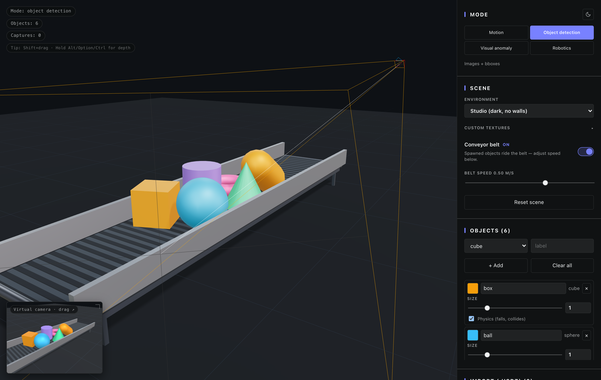
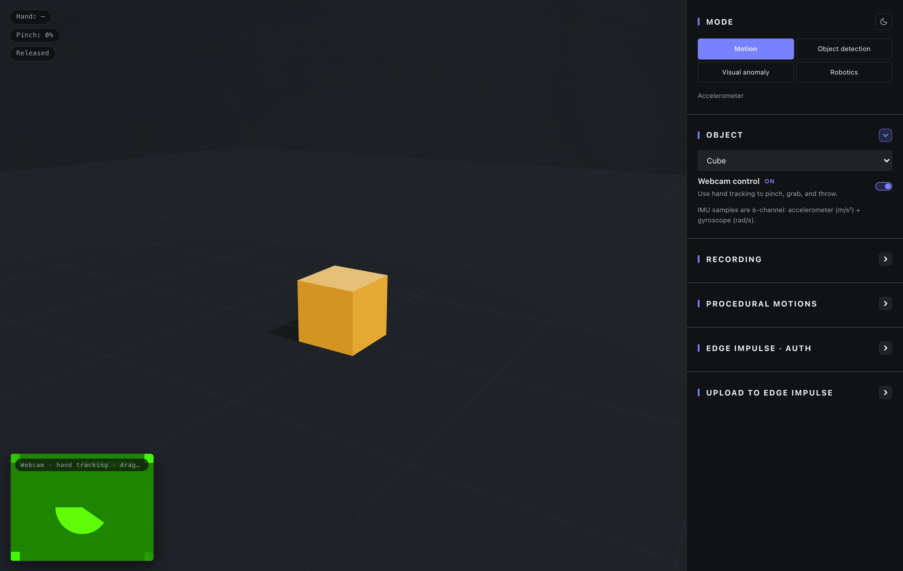
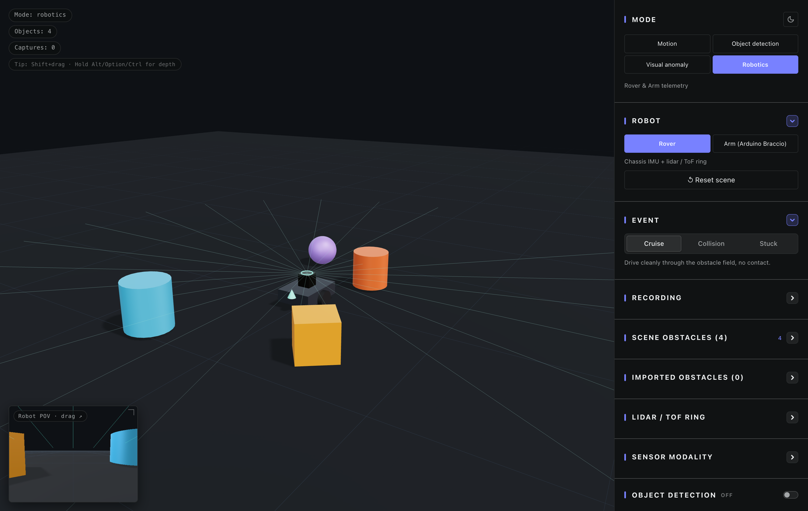

# Synthetic Data Studio

[](https://github.com/yennster/synthetic-data-studio/releases)
[](https://github.com/yennster/synthetic-data-studio/actions/workflows/test.yml)
[](https://github.com/yennster/synthetic-data-studio/actions/workflows/iframe-embed.yml)
[](https://github.com/yennster/synthetic-data-studio/actions/workflows/release.yml)
[](LICENSE)
[](https://github.com/yennster/synthetic-data-studio/stargazers)
[](https://react.dev)
[](https://threejs.org)
[](https://www.edgeimpulse.com/)

A browser-based 3D tool for generating synthetic training data for [Edge Impulse](https://www.edgeimpulse.com/) projects. Four modes in one app:

- **Motion** — pinch a virtual object with hand-tracked gestures (or use the procedural generator with no webcam) and capture realistic 6-channel IMU data (3-axis accel + 3-axis gyro, body-local).
- **Object detection** — drop labelled objects into a 3D scene (4 environment presets, optional conveyor belt, USDZ import), point a virtual camera, capture single shots or randomized batches with auto-projected bounding boxes.
- **Visual anomaly detection** — same capture pipeline as detection, batch-labelled (`normal` / `anomaly`).
- **Robotics** — synthetic-rover collision detection (chassis IMU + 2D lidar/ToF ring, classified as `cruise` / `collision` / `stuck`) and an Arduino TinkerKit Braccio arm with end-effector IMU + IK-driven pick-and-place. [More →](docs/robotics.md)

Run trained Edge Impulse YOLO / MobileNet / FOMO models **directly in-browser** for live inference on the virtual-camera preview.

Built with AI coding assistants.



*Object detection mode: 5 labelled objects on a scrolling conveyor belt, virtual capture camera shown as the orange frustum gizmo, live preview in the bottom-left corner.*



*Motion mode: pinch the cube with your hand to grab it, throw it onto the ground, record the accelerometer trace.*



*Robotics mode: rover scene with lidar / ToF beams, obstacle objects, onboard POV preview, and the robotics generator controls.*

## Features

**Shared**
- HDRI-lit 3D scene with ACES tone mapping, contact shadows.
- Light / dark theme toggle (defaults to dark; persists; URL-overridable).
- Live HUD with mode-aware status pills.
- Direct upload to the [Edge Impulse Ingestion API](https://docs.edgeimpulse.com/apis/ingestion).
- API keys held in memory only — never persisted.
- Auto-attached EI metadata on every sample: direct uploads use `x-metadata`, and downloaded time-series zips include an `info.labels` sidecar. [More →](docs/internals.md#auto-attached-ei-metadata)

**Motion mode**
- Hand tracking (Google MediaPipe `HandLandmarker`, in-browser, ~60 fps); toggle off for cameraless work.
- Pinch-to-grab + rotate; release inherits hand velocity for throws.
- 6-channel IMU output (`accX/Y/Z` m/s² + `gyrX/Y/Z` rad/s, body frame).
- 7 object kinds (cube, sphere, cylinder, torus, capsule, phone, soda can).
- **Procedural motion generator** — pick `drop` / `throw` / `push` / `shake`, set count, height range, and per-sample duration; auto-runs through the batch. Upload directly or download as a zip.
- Configurable sample rate (20–500 Hz, default 100). Optional HMAC-SHA256 signing for time-series JSON payloads.

**Object detection / Visual anomaly mode**
- 4 environment presets (Studio / Warehouse / White box / Outdoor) plus per-slot custom textures (Floor / Wall / Object) stored in IndexedDB.
- Multi-object spawning with custom labels, colors, sizes, and per-object physics on/off.
- Shift+drag to position objects; Alt/Option/Ctrl/Cmd mid-drag for depth mode; mouse wheel during drag for push/pull.
- USDZ import (Crate + ASCII + UsdSkel animation). [More →](docs/usdz.md)
- Conveyor belt that actually transports spawned bodies (speed-tunable −2 to +2 m/s).
- Virtual capture camera (XYZ + FOV) with a draggable frustum gizmo; non-random batch trajectories expose a pink orbit-center marker that you can Shift+drag to retarget the path.
- Single-shot capture downloads as a zip with the PNG + matching `bounding_boxes.labels` sidecar; batch capture randomizes camera / lighting / object positions and zips the whole batch.
- Direct upload to EI with bounding boxes attached; one-click retrain.
- **Realism post-process** — optional per-capture pass that narrows the sim-to-real gap. Five independent sliders (0–100%): **film grain**, **radial chromatic aberration** (zero at the optical center, max at the corners), **vignette**, **color jitter**, and a **JPEG round-trip** that injects real 8×8 DCT compression artifacts. Each effect is its own knob so you can dial them in independently (e.g., heavy grain + no vignette). All five run client-side — no API calls, no spend. Geometry never moves, so bounding boxes stay byte-perfect against the modified PNG. Per-effect intensities are recorded as `realism_*` metadata on every EI upload so you can ablate against them later. (A `Diffusion` mode is wired internally — Vercel Function → Hugging Face Inference — but hidden in the UI until a stable serverless image-to-image model is sourced.)
- Scene state persists across reloads (primitives, USDZ assets, camera settings).

**Edge Impulse model inference (vision + robot POV)**
- Fetch a built WebAssembly deployment straight from your project, or upload `.js` + `.wasm` manually.
- Live inference at ~5 Hz on the virtual-camera preview (detection / anomaly) **or** the rover / arm POV preview (robotics with object detection enabled); bounding boxes / FOMO centroids / visual-anomaly heatmap.

**Robotics mode**
- Two synthetic robot rigs in one mode behind a kind toggle:
  - **Rover** — differential-drive chassis with a configurable lidar / ToF ring (4–64 beams, 1–20 m range). Records combined 6-channel chassis IMU + N-channel lidar time-series labelled as `cruise` / `collision` / `stuck`. MuJoCo's contact solver produces the impact acceleration; the app reads contacts as the bumper signal instead of injecting artificial impulses.
  - **Arm** — Arduino TinkerKit Braccio (6-DOF: M1–M6, published servo limits). Records 6-channel end-effector IMU labelled as `pick_place` / `sweep` / `wave` / `random_pose` / `draw_circle`. Pick-and-place uses analytical IK against primitive or imported USDZ pickup targets, keeps the gripper clear of the floor, and records pickup success / failure metadata.
- **Sensor modality picker** for the rover: upload **Fused (IMU+lidar)**, **IMU only**, or **Lidar only** to compare model accuracy or train one tower at a time.
- **ROS 2 export**: toggle on to also write canonical JSONL bundles alongside the EI payload: rover exports `sensor_msgs/Imu` + `sensor_msgs/LaserScan`, and arm exports `sensor_msgs/Imu` + `sensor_msgs/JointState`.
- Synthetic IMU noise model (MathWorks `imuSensor`-style: Allan-variance noise density, bias instability, scale-factor error, ADC quantization, saturation) applied to motion / rover / arm IMU paths. Defaults match an LSM6DSO at ±4 g / ±2000 dps.
- Manual object spawning (pillars / crates / cans) and USDZ imports via the **Scene obstacles** / **Pickup objects** / **Imported** cards; obstacles and pickup targets are draggable with the same `Shift+drag` controls as detection mode.
- First-person POV camera (front-mounted on rover, wrist-mounted on arm) renders into the corner overlay so you can see what the robot's onboard camera would see during the trajectory.
- **Object detection capture**: toggle on to layer image capture (with auto-projected 2D bounding boxes) on top of the sensor recording. The runner probes the linked EI project's data type up-front and asks you to confirm — matching data uploads, conflicting data downloads as a local zip with `bounding_boxes.labels`. Configurable N images per iteration (mid-motion) or one image at rest. Lidar / ToF beams are auto-hidden from the captured PNGs.
- **Live model inference on the POV preview**: when object detection is on, load an Edge Impulse WebAssembly deployment and run it against the rover / arm POV at 5 Hz to see what the onboard model would detect.
- **Realism post-process** also available here — applies to the POV image captures when object detection is on.

- URL deep links: `?mode=robotics&robot=arm` lands directly on the arm rig.

[Robotics docs →](docs/robotics.md)

## Tech stack

| Layer | Library |
|---|---|
| Build | Vite + React 18 + TypeScript |
| 3D rendering | three.js + `@react-three/fiber` + `@react-three/drei` |
| Physics + sensors | MuJoCo WebAssembly (`@mujoco/mujoco`) for the manipulated body, the arm + pickup target, and the rover + obstacles. Rapier (`@react-three/rapier`) is retained for the vision-mode conveyor + spawned objects. |
| Hand tracking | `@mediapipe/tasks-vision` (HandLandmarker, GPU delegate) |
| USDZ import | `@needle-tools/usd` (OpenUSD WASM with UsdSkel) |
| EI model inference | Edge Impulse WebAssembly deployment (Embind) |
| ZIP read/write | Hand-rolled (STORE + DEFLATE via `DecompressionStream`) |
| State | Zustand |
| Upload | Fetch multipart ingestion + WebCrypto SubtleCrypto (HMAC for signed time-series JSON) |

## Quick start

Pick whichever fits:

### Option A — run the published package (no clone)

```bash
# Authenticate to GitHub Packages once (paste a personal access token with read:packages):
echo "//npm.pkg.github.com/:_authToken=YOUR_TOKEN" >> ~/.npmrc

# Then:
npx @yennster/synthetic-data-studio
```

Opens on http://localhost:5173 with COOP/COEP preconfigured. Add `--port 8080` to change port, `--no-coep` to disable cross-origin isolation (USDZ import will then fail but everything else works).

> Note: the strict defensive headers (CSP, Permissions-Policy, X-Content-Type-Options, Referrer-Policy) are paused — see [drafts/security-hardening/README.md](drafts/security-hardening/README.md). COOP/COEP/CORP stayed because USDZ needs them. To re-enable the defensive block on your self-host, paste the relevant parked blocks into `vercel.json` / `bin/serve.mjs`.

### Option B — download the release zip

Grab the latest `synthetic-data-studio-vX.Y.Z.zip` from [Releases](https://github.com/yennster/synthetic-data-studio/releases), unzip, and serve from any static host. The bundle includes a `_headers` file preconfigured for Netlify and Cloudflare Pages, and a `vercel.json` at the repo root for Vercel deployments — both wire up the cross-origin-isolation headers that the USDZ WASM loader needs.

### Option C — clone and run

```bash
git clone https://github.com/yennster/synthetic-data-studio
cd synthetic-data-studio
npm install
npm run dev
```

Open **http://localhost:5173** in a Chromium-based browser (Chrome, Edge, Brave).

> **Camera permission is required for Motion mode.** Detection / Anomaly modes don't use the webcam and run anywhere.

## Workflows

Step-by-step instructions for each mode are in **[docs/workflows.md](docs/workflows.md)**:

- [Recording motion data (manual)](docs/workflows.md#recording-motion-data-manual)
- [Generating motion data procedurally](docs/workflows.md#generating-motion-data-procedurally-no-webcam-needed)
- [Capturing object-detection data](docs/workflows.md#capturing-object-detection-data)
- [Running an Edge Impulse model in-browser](docs/workflows.md#running-an-edge-impulse-model-in-browser)
- [Capturing visual-anomaly data](docs/workflows.md#capturing-visual-anomaly-data)
- [Capturing robotics data (Rover / Arm)](docs/workflows.md#capturing-robotics-data-rover--arm)

## Edge Impulse setup

1. **Dashboard → Keys** in your Edge Impulse project.
2. Copy the **API key** (`ei_…`). For motion and robotics time-series uploads, optionally also copy the **HMAC key** for signed JSON payloads.
3. Paste into the sidebar; choose **Training** or **Testing**.

For the exact JSON / multipart payloads sent to the ingestion API, see [docs/internals.md#edge-impulse-payload-formats](docs/internals.md#edge-impulse-payload-formats).

## URL parameters

The app reads query parameters at load so you can deep-link a configured studio, share-this-batch URLs, set up iframe embeds, lock down a single-mode demo, and reproduce datasets seed-for-seed. Full reference (every key, every allowed value, recipes): **[docs/url-parameters.md](docs/url-parameters.md)**.

A few common ones:

| Param        | Example                                                | Effect                                                                                  |
| ------------ | ------------------------------------------------------ | --------------------------------------------------------------------------------------- |
| `env`        | `?env=outdoor`                                         | Switch backdrop (`studio` · `warehouse` · `whitebox` · `outdoor`).                       |
| `mode`       | `?mode=detection`                                      | Land in a specific mode. Aliases: `objects`, `objectdetection`, `arm`, `rover`, `imu`, … |
| `onlyMode`   | `?onlyMode=detection`                                  | Hide every other mode button so the user can't switch away.                              |
| `objects`    | `?objects=cube,sphere,phone`                           | Pre-spawn these object kinds.                                                            |
| `trajectory` | `?trajectory=circle&radius=4&height=2`                 | Camera path for batch capture.                                                           |
| `batchCount` | `?batchCount=50`                                       | Preset the batch slider.                                                                 |
| `seed`       | `?seed=42`                                             | Seed the RNG — every random choice in batch jitter + realism becomes deterministic.       |
| `embed`      | `?embed=1`                                             | Hide sidebar + HUD for clean iframe embeds.                                              |
| `theme`      | `?theme=light`                                         | Force the chrome theme on this load.                                                     |
| `apiKey`     | `?apiKey=ei_…`                                         | Pre-fill the Edge Impulse API key.                                                       |

Examples:

```
https://synthetic.jennyspeelman.dev/?env=outdoor&objects=cube,sphere&batchCount=20&trajectory=circle&seed=42
https://synthetic.jennyspeelman.dev/?onlyMode=detection&embed=1
https://synthetic.jennyspeelman.dev/?mode=arm&armPose=1.57,1.0,0.5,1.57,1.57,0.5
https://synthetic.jennyspeelman.dev/?apiKey=ei_abc123&eiCategory=split&autoUpload=1
```

Unknown values are dropped silently — the app falls back to whatever was stored or the built-in default. Values are case-insensitive.

## Embedding in an iframe

The app is designed to be iframed from any origin (`frame-ancestors *`). Drop this into any page:

```html
<iframe
  src="https://synthetic.jennyspeelman.dev/"
  allow="camera; autoplay; fullscreen; cross-origin-isolated"
  width="1200"
  height="800"
  style="border: 0; border-radius: 8px;">
</iframe>
```

Verified end-to-end by [`scripts/test-iframe-embed.mjs`](scripts/test-iframe-embed.mjs) — runs on every PR via the `iframe-embed` GitHub Action above. It spins up six cross-origin parent servers (plain HTML, COI parent with + without `cross-origin-isolated` delegation, a `studio.edgeimpulse.com` header mimic with + without COI, and a sandboxed iframe) and asserts whether the iframe is COI, `SharedArrayBuffer` is available, and the 3D canvas mounts in each case. Run locally with `npm run test:iframe`. The recipes below are variations on this base embed — only the URL query string changes.

What each `allow` token enables:

| Token | Why it's needed |
| --- | --- |
| `camera` | Motion-mode hand tracking needs the webcam. Without this, the parent can't delegate camera access to the iframe and `getUserMedia` fails. |
| `autoplay` | The webcam `<video>.play()` call gets silently rejected in cross-origin iframes unless autoplay is delegated. |
| `fullscreen` | Lets the parent offer an "expand the 3D canvas" control via `Element.requestFullscreen()`. |
| `cross-origin-isolated` | Required for USDZ import to work inside the iframe (see below). Omit if you don't care about USDZ. |

The user still gets the normal browser permission prompt for the webcam on first use — `allow="camera"` just unblocks the iframe-permission inheritance, it doesn't auto-grant.

### USDZ import inside the iframe

USDZ import uses `SharedArrayBuffer` (via OpenUSD's WASM), which only works when the iframe is **cross-origin-isolated**. For that, three things have to line up:

1. **The iframe response** sends `COOP: same-origin` + `COEP: credentialless` + `CORP: cross-origin`. Already shipped.
2. **The parent page** is itself cross-origin-isolated — set these headers on the parent's response:
   ```
   Cross-Origin-Opener-Policy: same-origin
   Cross-Origin-Embedder-Policy: credentialless
   ```
3. **The parent delegates COI to us** via the `allow="cross-origin-isolated"` token in the example above. The browser default for cross-origin iframes is `cross-origin-isolated=(self)`, which excludes us unless the parent opts in.

Drop any of (2) or (3) and USDZ import fails with `SharedArrayBuffer transfer requires self.crossOriginIsolated`. Everything else (object/anomaly capture, hand tracking, batch upload to Edge Impulse) keeps working — only USDZ needs COI.

### Iframe URL recipes

```html
<!-- Locked-down "object detection only" embed, outdoor env, 20-shot batch -->
<iframe
  src="https://synthetic.jennyspeelman.dev/?onlyMode=detection&embed=1&env=outdoor&batchCount=20&seed=42"
  allow="camera; autoplay; fullscreen"
  width="1200" height="800"></iframe>

<!-- Pre-authed embed that uploads straight to your EI project -->
<iframe
  src="https://synthetic.jennyspeelman.dev/?embed=1&apiKey=ei_abc123&autoUpload=1"
  allow="camera; autoplay; fullscreen"
  width="1200" height="800"></iframe>

<!-- Motion-mode demo with a fixed theme and chrome stripped -->
<iframe
  src="https://synthetic.jennyspeelman.dev/?mode=motion&embed=1&theme=light&gizmos=0"
  allow="camera; autoplay; fullscreen"
  width="1200" height="800"></iframe>
```

Full URL-parameter reference: [docs/url-parameters.md](docs/url-parameters.md). Background on the cross-origin-isolation chain: [docs/usdz.md#cross-origin-isolation-requirement](docs/usdz.md#cross-origin-isolation-requirement).

## Privacy notes

- The webcam stream **never leaves the browser** in any mode. MediaPipe runs locally; only data you explicitly capture/upload is sent anywhere.
- API keys are kept in JavaScript memory only — not in `localStorage`, `sessionStorage`, cookies, or any file. Reload = wiped.
- Image saves go to your local disk (or downloads); only Edge Impulse uploads leave the machine, over HTTPS to `ingestion.edgeimpulse.com`.
- **Scene state is persisted locally** so it survives reloads — spawned primitives, conveyor / environment / capture settings, current mode, theme preference, and any imported `.usdz` files (metadata in `localStorage`, the original USDZ bytes in IndexedDB). Nothing is uploaded; this is per-browser, per-origin storage on your own machine. Clear it via your browser's site-data settings, by removing each asset from the UI, or with the **Clear** controls in the Scene / Imported assets cards.
- Captures (rendered images and IMU samples) are **not** persisted — they live in memory until you save or upload them.
- Because the local persistence above is strictly to deliver functionality you explicitly requested (importing assets, building a scene), it falls under the ePrivacy Directive's "strictly necessary" exemption — no consent banner is required. Not legal advice; verify for your jurisdiction.

## More docs

- **[docs/workflows.md](docs/workflows.md)** — step-by-step instructions for every mode.
- **[docs/url-parameters.md](docs/url-parameters.md)** — deep-link query string reference (`?env=outdoor&seed=42&objects=cube,sphere&batchCount=50&trajectory=circle…`).
- **[docs/usdz.md](docs/usdz.md)** — USDZ import: what's supported, capturing real-world objects, format conversion, MDL/Omniverse caveats, cross-origin isolation setup.
- **[docs/internals.md](docs/internals.md)** — project structure, IMU math, bbox projection, tunables, EI payload formats.
- **[docs/troubleshooting.md](docs/troubleshooting.md)** — common errors and fixes.

## Testing

```bash
npm test               # one-shot vitest run (CI mode)
npm run test:watch     # interactive watch mode
npm run test:coverage  # with v8 coverage report
npm run test:iframe    # all 6 iframe-embed scenarios (requires `npm run dev` running on :5173)
```

Stack: **Vitest** + **happy-dom**. Pure-logic libraries (`handMath`, `beltDynamics`, `capture` helpers, `edgeImpulse` payload + HMAC + `info.labels`, arm pickup geometry / outcome metadata, store transitions, theme state, zip read/write, URL-param parsing) are covered, along with the MuJoCo MJCF generators (`braccioMjcf`, `roverMjcf`, `motionMjcf`) and the shared IMU sampler. The MediaPipe / OpenUSD / Rapier / MuJoCo WASM runtimes are stubbed in test config since they're browser-runtime-only — those are exercised in the headless screenshot script and end-to-end manual testing.

### Iframe-embed scenarios

`npm run test:iframe` spins up six cross-origin parent servers and drives a headless Chrome through each one, asserting `crossOriginIsolated`, `SharedArrayBuffer` availability, and that the 3D canvas mounts. Run one scenario by name:

```bash
npm run test:iframe -- studio-edgeimpulse-mimic
```

| Scenario | Parent posture |
| --- | --- |
| `plain-parent` | No security headers — minimal embedder. |
| `coi-parent-delegates` | COOP+COEP + `allow="cross-origin-isolated"` — USDZ-ready chain. |
| `coi-parent-no-delegation` | COI parent missing the `allow=` token — should not propagate isolation. |
| `studio-edgeimpulse-mimic` | Mimics real `studio.edgeimpulse.com` headers (CSP, X-Content-Type-Options, X-Frame-Options, Referrer-Policy — no COOP/COEP). |
| `studio-edgeimpulse-with-coi` | Studio-like CSP + the COOP/COEP it would need to add for USDZ inside its iframe. |
| `sandboxed-iframe` | `<iframe sandbox>` with the typical relaxations a security-conscious embedder sets. |

Two GitHub Actions workflows run on every push + PR: [`.github/workflows/test.yml`](.github/workflows/test.yml) runs `tsc --noEmit` + `npm test`, [`.github/workflows/iframe-embed.yml`](.github/workflows/iframe-embed.yml) runs the six iframe scenarios end-to-end.

## Build for production

```bash
npm run build
npm run preview
```

The output in `dist/` is a static bundle — host on any static host. All processing is client-side.

Regenerate the main screenshots with `npm run screenshot -- all` and the sidebar-card screenshots with `node scripts/screenshot-cards.mjs all` while the Vite dev server is running on port 5173. Both scripts require Chrome at the standard macOS path; override with `CHROME_PATH=…`.

## License

[Apache-2.0](LICENSE) — permissive open source. You can use, modify, and redistribute this code commercially, including as a service, provided you keep the copyright notice and `NOTICE` file (if any).

Note: this project depends on [`@needle-tools/usd`](https://www.npmjs.com/package/@needle-tools/usd) for USDZ rendering, which is **not** Apache-licensed and asks you to contact `hi@needle.tools` for commercial use of *that* package. That obligation is between you and Needle and does not affect the Apache-2.0 grant on the code in this repository.
