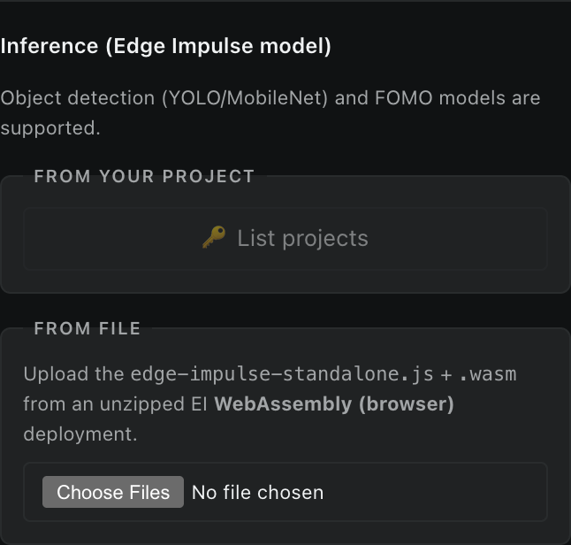

For **NVIDIA GTC 2024**, Hannah Moshtaghi, Fernando Jiménez Moreno, and I built an [Edge Impulse extension for NVIDIA Omniverse](https://github.com/edgeimpulse/edge-impulse-omniverse-ext) — a path-traced synthetic data generation pipeline that ingests labelled images straight into your Edge Impulse project. We wrote up the workflow in two posts: [How to use USD assets for any edge AI use case with NVIDIA Omniverse](https://www.edgeimpulse.com/blog/how-to-use-usd-assets-for-any-edge-ai-use-case-with-nvidia-omniverse/) and [Creating a robust synthetic dataset using NVIDIA Omniverse — tips & tricks](https://www.edgeimpulse.com/blog/creating-a-robust-synthetic-dataset-using-nvidia-omniverse-tips-tricks/).

It is a fantastic tool, but Omniverse has some hard prerequisites: a hefty NVIDIA GPU or an NVIDIA cloud subscription, plus the Omniverse runtime and a non-trivial setup. Edge Impulse is the opposite, entirely cloud-based, accessible from any browser. Generating the data from Omniverse and training a model with it in Edge Impulse felt like two completely separate workflows that happened to share a common destination.

So I wanted to know: how much of the synthetic-data story can we collapse back into the same web browser where the rest of Edge Impulse already lives? What if there was a "good enough" version of the renderer that ran on whatever GPU the user already has — including the integrated one in their laptop — with no install, no permissions beyond a webcam toggle, and no context switch?

[**Synthetic Data Studio**](https://synthetic.jennyspeelman.dev/) is a browser-based 3D tool for generating synthetic training data for Edge Impulse projects. No Unity, no Blender, no Python, no Omniverse — just a web app running Three.js, MuJoCo, and Rapier where each fits best. Open it, pick a mode, paste your project API key, and start ingesting samples via the [Edge Impulse Ingestion API](https://docs.edgeimpulse.com/apis/ingestion).

The first version was built with [Claude Code](https://www.anthropic.com/claude-code) over a few days. More on that below.

> **Try it now:** open the [live demo at synthetic.jennyspeelman.dev](https://synthetic.jennyspeelman.dev/), or clone the repo at [github.com/yennster/synthetic-data-studio](https://github.com/yennster/synthetic-data-studio) and run it locally.

If you do not have an Edge Impulse account yet, [sign up for free at edgeimpulse.com](https://studio.edgeimpulse.com/signup) — the Studio's upload + retrain features need a project API key, and the free tier is more than enough to follow along.

## Four data types, one app

The Synthetic Data Studio gives you four workflows that share a scene, an asset pipeline, and Edge Impulse API authentication. You pick the mode at the top of the sidebar — everything else reshapes around what you're doing.

### Motion mode — IMU traces from a virtual object

*The 6-channel IMU trace gets recorded in the object's body frame, exactly the way a real accelerometer + gyro would see it.*

**What if you could record motion data without using any dev boards?** Pinch your fingers, the cube turns teal and follows your hand. Release, and physics takes over — the cube falls, bounces, settles. The accelerometer reads `+9.81 m/s²` on the up axis when stationary and near-zero in freefall, like you'd expect from a real sensor reporting proper acceleration. The gyroscope channel gives you angular velocity in the body frame.

If you'd rather skip the camera entirely, use the **procedural motion generator** and four different types of motions (drop, throw, push, shake) are recorded and automatically uploaded into your Edge Impulse project.

### Object detection & visual anomaly mode — labelled images on demand

You can spawn objects (cube, sphere, cylinder, cone, torus, capsule, phone slab, soda can — or import your own [USDZ assets](https://openusd.org/release/spec_usdz.html)), give them labels, drop them on a backdrop, point the virtual camera at them, and capture. Single shots or randomized batches. Bounding boxes are auto-projected from each labelled mesh's world-space and auto-uploaded to your Edge Impulse project, no user bounding box labeling required.

### Robotics mode — rover and arm time-series

Robotics mode adds two MuJoCo-backed rigs: a differential-drive rover with chassis IMU plus configurable lidar / ToF range bins, and an Arduino TinkerKit Braccio arm with end-effector IMU and pick-and-place trajectories. Rover samples are labelled as `cruise`, `collision`, or `stuck`; arm samples are labelled by trajectory. Imported USDZ assets can be rover obstacles or Braccio pickup targets, and pick-and-place metadata records whether the object was actually lifted successfully.

### Inference, in the browser

Once you've trained a model in Edge Impulse, the Synthetic Data Studio can fetch your project's WebAssembly deployment, unpack the zip in-browser, and run inference on the virtual camera's preview at ~5 Hz. Detection boxes, FOMO centroids, and labels overlay onto the preview live. It's a useful sanity check — you can tell within a few seconds whether your synthetic dataset generalised at all.

## Auto-attached EI metadata

Every sample uploaded directly from the Synthetic Data Studio carries an [`x-metadata`](https://docs.edgeimpulse.com/studio/projects/data-acquisition/metadata) JSON header, and downloaded time-series zips include an `info.labels` sidecar so the same labels and metadata survive a later Studio upload. The metadata tags samples with:

- `source: "Synthetic Data Studio"`
- `source_url`: the page URL the sample was generated on
- `shape`: object kind for default primitives (motion mode) or `shapes` (vision mode, comma-separated)
- `motion`: motion class for procedural runs
- `robot_kind`, `event`, `trajectory`, `modality`, `lidar_bins`, and pickup outcome fields for robotics runs
- `env_preset`, `conveyor`, `width`, `height`, `capture_ts`: scene context (vision mode)
- `asset_files` + `asset_labels`: filenames + labels of imported USDZ assets present at capture time
- `split_bucket`: which side of the 80:20 split a sample landed on (when split mode is enabled)

It's all automatic — no extra UI fields. The point is that once you've collected a few thousand samples, you can filter the EI data view by where they came from, or by motion class, or by which environment preset was active.

## Vibe-coding the project

A note on how the first version was built: I have never used Three.js, I have never shipped a Rapier physics integration before, and I'd never built a USDZ importer. None of that mattered. I described what I wanted, Claude Code wrote the first draft, I tested it, and I asked it to fix what did not work. The project has kept evolving through the same conversational coding workflow.

If you want to try this approach on your own Edge Impulse project, **we just published a series of guides** that walk through using AI coding assistants - Claude Code, Gemini CLI, GitHub Copilot, and more - with the Edge Impulse SDKs and APIs:

> 📚 [**Edge Impulse · AI assistants tutorials**](https://edgeimpulse-llm-tools.mintlify.app/tutorials/integrations/ai-assistants)

The series covers setup walk-throughs, prompt inspiration, and full end-to-end workflows of building Edge Impulse integrations just like this one.

## Try it out

> 🌐 **Live demo:** [synthetic.jennyspeelman.dev](https://synthetic.jennyspeelman.dev/) -- 📦 **Source:** [github.com/yennster/synthetic-data-studio](https://github.com/yennster/synthetic-data-studio)

If you build an Edge Impulse integration or application with an AI assistant, let us know! [Share it on the Edge Impulse forum](https://forum.edgeimpulse.com/).
